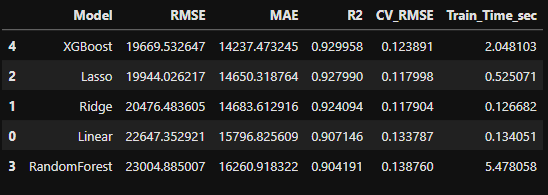
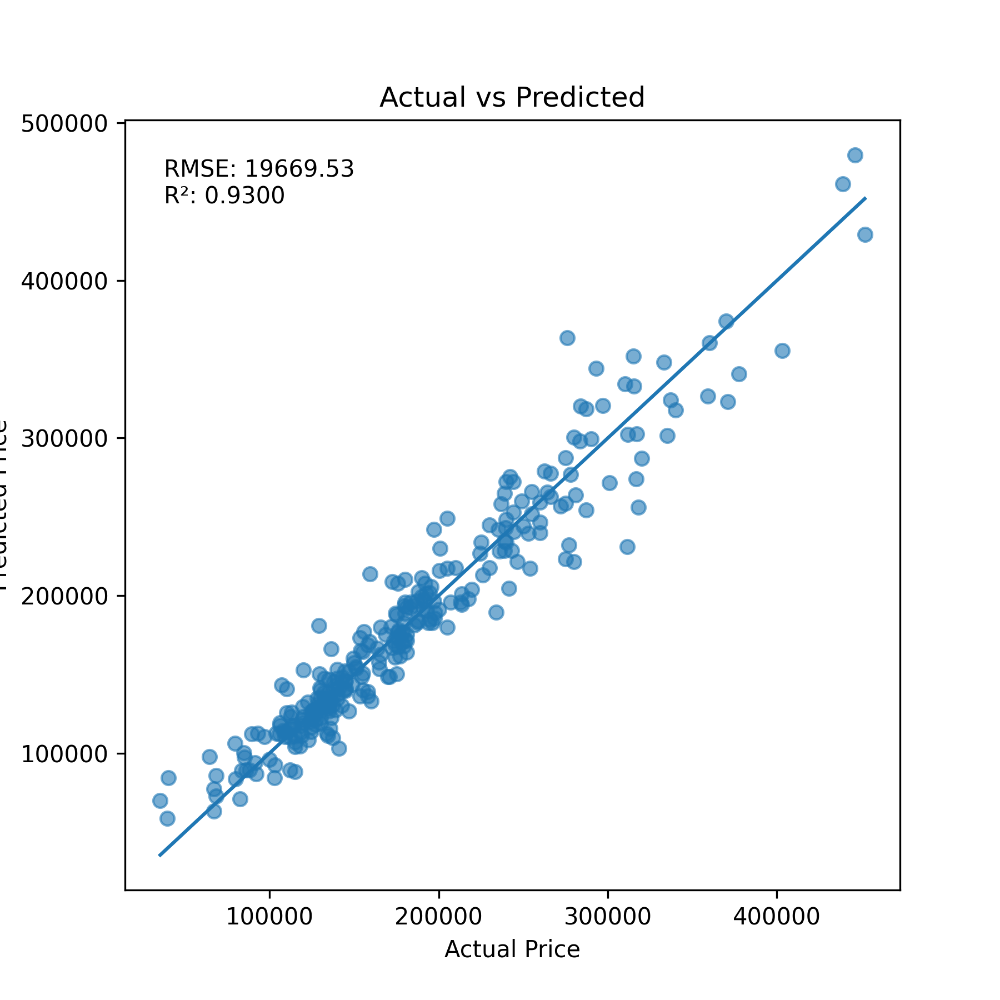
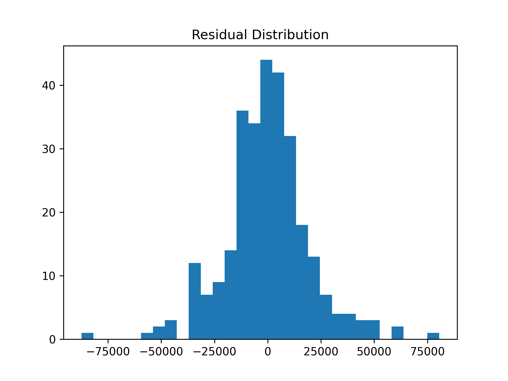
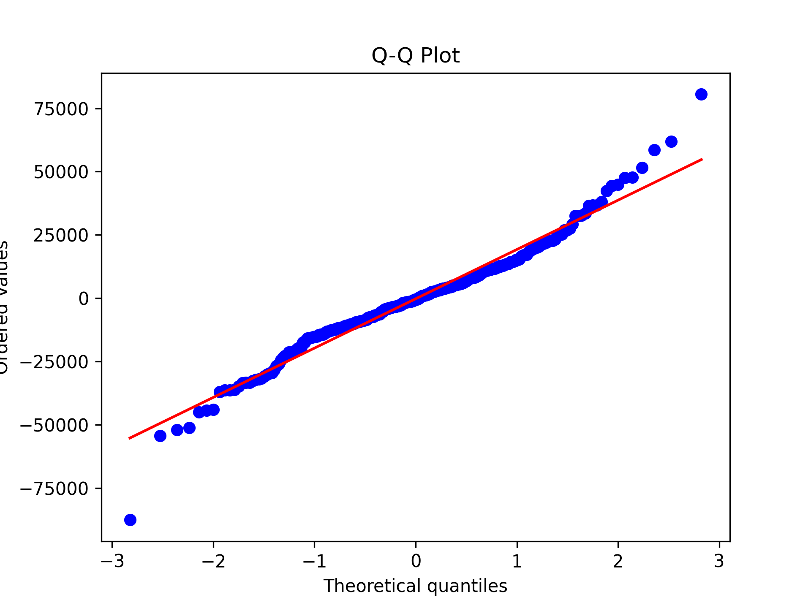

# 🏠 House Price Prediction (Advanced Regression Project)

## 📌 Overview  
This project aims to predict residential house prices using advanced regression techniques on the Ames Housing dataset. The goal is to build a robust machine learning pipeline that can accurately estimate property prices based on various structural and quality-related features.

---

## 🎯 Business Problem  
Accurately predicting house prices is crucial for:
- Real estate agents for pricing strategies  
- Buyers and sellers for fair valuation  
- Investors for decision-making  

This project provides a data-driven approach to estimate property values.

---

## 📊 Dataset  
- **Dataset:** Ames Housing Dataset  
- **Target Variable:** `SalePrice`  
- **Features:** 80+ numerical and categorical variables describing house properties  

---

## 🧹 Data Preprocessing  

The preprocessing pipeline includes:

- Handling missing values  
  - Numerical → Median imputation  
  - Categorical → Most frequent value  

- Encoding categorical features  
  - One-Hot Encoding  

- Feature Engineering  
  - Created `TotalSF` (Total Square Footage)

- Pipeline Design  
  - Used `ColumnTransformer` + `Pipeline`  
  - Ensures reproducibility and avoids data leakage  

---

## 🤖 Models Used  

The following regression models were trained and evaluated:

- Linear Regression  
- Ridge Regression  
- Lasso Regression  
- Random Forest Regressor  
- **XGBoost Regressor (Best Model)**  

---

## 🏆 Model Performance  

### 📌 Model Comparison

| Model         | RMSE   | R² Score |
|--------------|--------|---------|
| XGBoost      | **19669** | **0.93** |
| Lasso        | 19944 | 0.927 |
| Ridge        | 20476 | 0.924 |
| Linear       | 22647 | 0.907 |
| RandomForest | 23004 | 0.904 |

👉 **XGBoost performed best due to its ability to capture complex nonlinear relationships and feature interactions.**

---

## 📈 Evaluation Metrics  

- **RMSE:** 19,669  
- **R² Score:** 0.93  

---

## 📉 Visualizations  

### 🔹 Actual vs Predicted

👉 Predictions closely follow actual values, indicating strong model performance.

---

### 🔹 Residual Distribution

👉 Residuals are approximately normally distributed, suggesting good model fit.

---

### 🔹 Q-Q Plot

👉 Points mostly align with the diagonal line, confirming near-normal error distribution with slight outliers.

---

## 🔑 Key Insights  

Top predictive features:

1. **OverallQual** – Overall material and finish quality  
2. **ExterQual** – Exterior quality  
3. **TotalSF** – Total living area  

### 💡 Interpretation:
- Higher construction quality significantly increases price  
- Exterior condition impacts buyer perception  
- Larger homes tend to sell at higher prices  

---

## 🚀 Deployment (Optional Enhancement)  

A Streamlit web application can be built to:
- Take user inputs (key features)  
- Predict house price instantly  
- Provide an interactive UI  

---

## 🛠️ Tech Stack  

- Python  
- Pandas, NumPy  
- Scikit-learn  
- XGBoost  
- Matplotlib / Seaborn  
- Streamlit (for deployment)  

---

## 🚀 Future Improvements  

- Hyperparameter tuning (Grid Search / Bayesian Optimization)  
- Ensemble methods (stacking/blending)  
- Adding location-based features  
- Deploying model on cloud (Streamlit Cloud / AWS)  
- Continuous model monitoring  

---

## ✅ Conclusion  

The project successfully builds a high-performing regression model using a structured pipeline.  
The **XGBoost model achieved strong accuracy (R² = 0.93)** and provides valuable insights into housing price drivers.

---

## 👨‍💻 Author  

*Deep Vejpara* 
